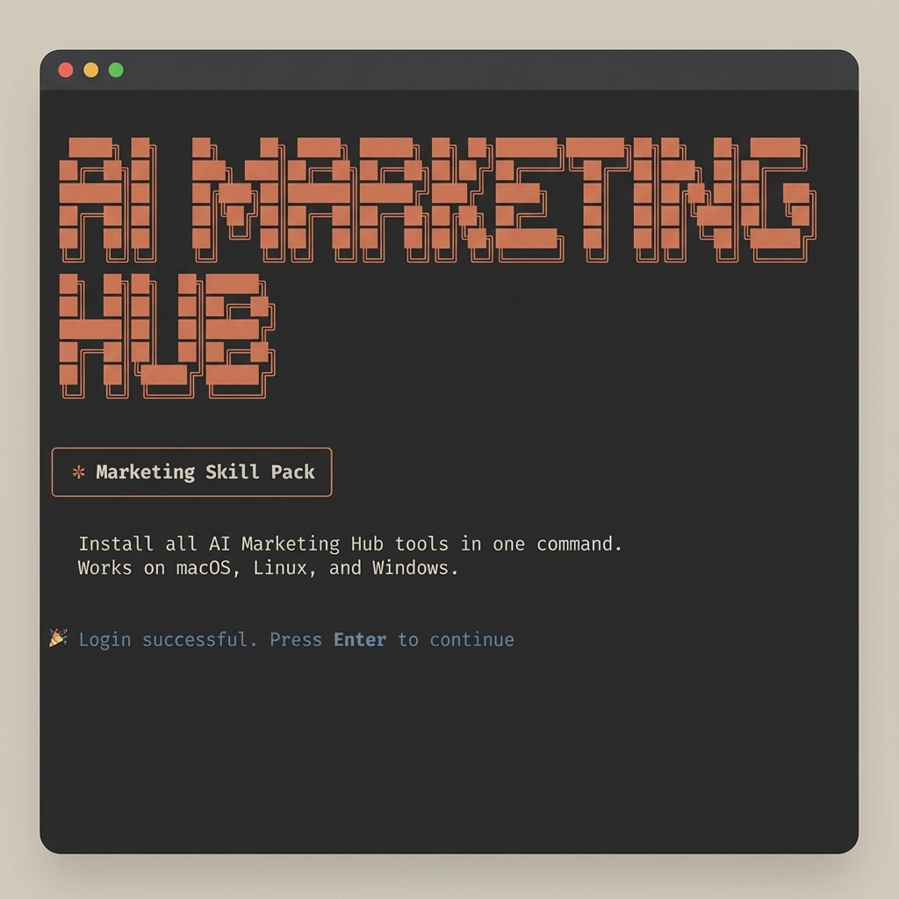

# AI Marketing Hub — Marketing Skill Pack



Install all AI Marketing Hub tools in one command. Works on macOS, Linux, and Windows.

---

## Install

**macOS / Linux:**
```bash
curl -fsSL https://raw.githubusercontent.com/AgriciDaniel/marketing-skill-pack/main/install.sh | bash
```

**Windows (PowerShell):**
```powershell
irm https://raw.githubusercontent.com/AgriciDaniel/marketing-skill-pack/main/install.ps1 | iex
```

> Already installed? Run the same command again to update everything to the latest version.

---

## What Gets Installed

| Tool | Type | Slash Command |
|------|------|--------------|
| [Claude Code + VS Code Essentials](https://github.com/AgriciDaniel/claude-code-essentials-vs-code) | Dev environment setup (26 extensions + Claude Code CLI) | — |
| [Claude SEO](https://github.com/AgriciDaniel/claude-seo) | SEO audits, page analysis, schema markup, sitemap | `/seo` |
| [Claude Blog](https://github.com/AgriciDaniel/claude-blog) | Write, rewrite, analyze, and schedule blog content | `/blog` |
| [Skill Forge](https://github.com/AgriciDaniel/skill-forge) | Design and build new Claude Code skills | `/skill-forge` |
| [WP MCP Ultimate](https://github.com/AgriciDaniel/wp-mcp-ultimate) | WordPress plugin — 57 AI-powered WP abilities | MCP server |

---

## Requirements

| Requirement | macOS | Linux | Windows |
|-------------|-------|-------|---------|
| git 2.x | `brew install git` | `apt install git` | [git-scm.com](https://git-scm.com/download/win) |
| Node.js 18+ | [nodejs.org](https://nodejs.org) | [nodejs.org](https://nodejs.org) | [nodejs.org](https://nodejs.org) |
| curl | pre-installed | `apt install curl` | pre-installed (Win 10+) |
| bash | pre-installed | pre-installed | Git Bash (included with Git) or WSL |

---

## WordPress Plugin

The WP MCP Ultimate plugin ZIP is downloaded automatically to `~/Downloads/wp-mcp-ultimate.zip`.
Install it manually after the script finishes:

1. Go to **WP Admin → Plugins → Add New → Upload Plugin**
2. Upload `wp-mcp-ultimate.zip`
3. Activate it, then go to **Tools → MCP Ultimate** to get your API key

**Cloudways users:** upload via the Cloudways WordPress panel instead.

---

## After Install

Restart Claude Code (close and reopen), then try:

```
/seo audit https://yoursite.com
/blog write "10 ways to use AI in marketing"
/skill-forge plan my-new-skill
```

---

## Updating

Run the same install command again at any time. The script detects existing installations and updates each one automatically — no extra steps needed.

---

## How It Works

Skill repos are cloned to `~/.claude/packs/` on first install. On re-runs, each repo is updated with `git pull` and its installer is re-run. This gives you:

- **Fresh install** → clones all repos and installs skills
- **Re-run** → updates each repo to the latest version and reinstalls
- **Partial install** → picks up where it left off

Errors in individual steps are reported but do not abort the rest of the installation.

---

## Windows Details

The PowerShell script (`install.ps1`) automatically finds Git Bash in common installation paths. If Git Bash is not found, it detects WSL bash as a fallback. If neither is available, it prints step-by-step instructions.

Git Bash comes bundled with [Git for Windows](https://git-scm.com/download/win) — most developers already have it.
